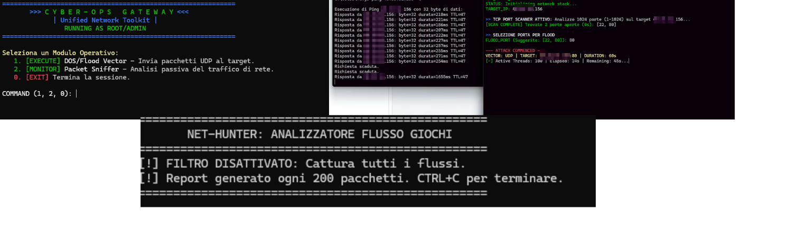

# 🌌 CYBER_OPS_GATEWAY: Unified Network Toolkit

<div align="center">
  
</div>

[](https://www.python.org/)
[](LICENSE)

**| Network Analysis & Stress Testing Console |**

Questo progetto consolida due moduli operativi distinti (Stress Test/Flood e Packet Sniffing/Analysis) in un'unica console di gestione. Il Gateway è stato configurato per forzare l'esecuzione con privilegi elevati (Root/Amministratore) al fine di garantire la piena funzionalità di rete e l'accesso ai socket RAW.

---

## ⚠️ Disclaimer Legale e Etico

L'uso di strumenti di rete potenti come il Packet Sniffing e il Traffic Flooding è **estremamente regolamentato**. Questo toolkit è stato sviluppato a scopo puramente **didattico, di ricerca sulla sicurezza e per test di carico su reti di PROPRIETÀ**.

* **Non utilizzare** questo software contro sistemi o reti di terze parti senza esplicito permesso scritto.
* L'utente è l'unico responsabile di qualsiasi danno o violazione legale derivante dall'uso improprio di questo toolkit.

---

## 🚀 Caratteristiche Principali

Il **`CYBER_OPS_GATEWAY`** funge da interfaccia centralizzata per due componenti fondamentali, eseguiti tramite `subprocess` per garantire la corretta gestione dei permessi:

1.  **EXECUTE - DOS/Flood Vector (`dosv2.py`):** Modulo ad alta concorrenza per testare la resilienza della rete inviando un elevato volume di pacchetti UDP al target.
2.  **MONITOR - Packet Sniffer (`sniffergame.py`):** Strumento di analisi passiva in tempo reale, capace di intercettare e analizzare pacchetti IP grezzi (RAW) e identificare flussi di traffico e indirizzi IP unici.

### Requisiti Tecnici

| Requisito | Sistema Operativo | Dettagli |
| :--- | :--- | :--- |
| **Python** | Tutti | Versione 3.6+ |
| **Privilegi** | Tutti | **Esecuzione obbligatoria come Root/Amministratore.** |
| **Librerie** | Tutti | Non sono richieste librerie esterne (solo moduli standard). |

---

## ⚙️ Setup e Installazione (ESEGUI COME AMMINISTRATORE)

Il progetto richiede una specifica struttura di directory.

### 1. Clona la Repository

```bash
git clone https://github.com/NickQuelloVero/CYBER_OPS_GETAWAY_v1.0.git
cd CYBER_OPS_GETAWAY_v1.0
python main.py
